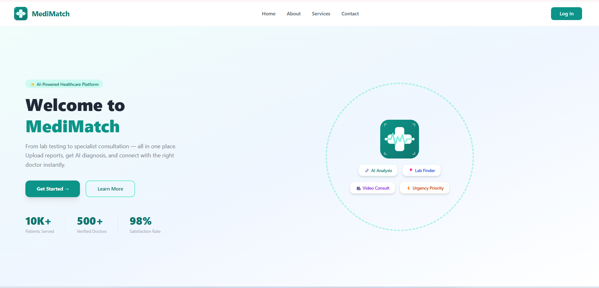
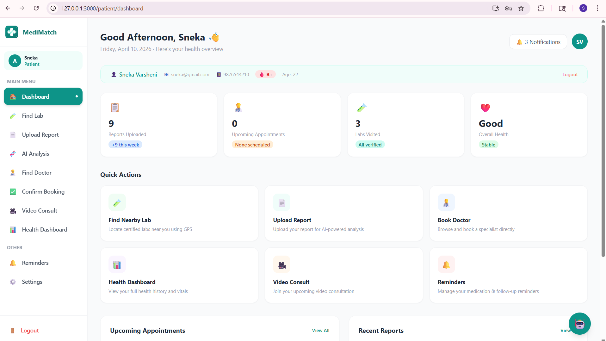
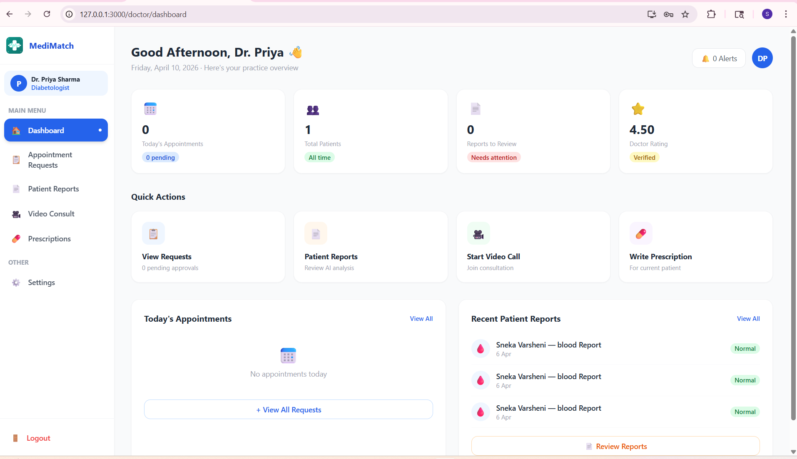

"# MediMatch" 
# MediMatch – AI Powered Healthcare Platform

## Project Overview

MediMatch is an AI-powered healthcare platform that helps users analyze medical reports and find suitable doctors automatically.
The system integrates report analysis, doctor recommendation, appointment booking, and video consultation in a single platform.

---

## Features

* Upload medical reports for analysis
* AI-based health report interpretation
* Doctor recommendation system
* Online appointment booking
* Video consultation with doctors
* Lab test finder based on user location
* Secure user authentication

---

## Tech Stack

### Frontend

* React.js
* Tailwind CSS
* Axios

### Backend

* Node.js
* Express.js
* MySQL

### Other Technologies

* JWT Authentication
* REST APIs
* Git & GitHub

---

## Project Structure

MiniProject
│
├── medimatch-backend
│   ├── controllers
│   ├── routes
│   ├── middleware
│   └── server.js
│
└── medimatch-frontend
├── components
├── pages
├── services
└── App.js

---

## How to Run the Project

### Backend

```bash
cd medimatch-backend
npm install
npm start
```

### Frontend

```bash
cd medimatch-frontend
npm install
npm start
```

The application will run on:

Frontend → http://localhost:3000
Backend → http://localhost:5000

---
## Screenshots
### Login Page


### Patient Dashboard


### Doctor Dashboard



## Author

Suroopa B
B.E Computer Science and Design
